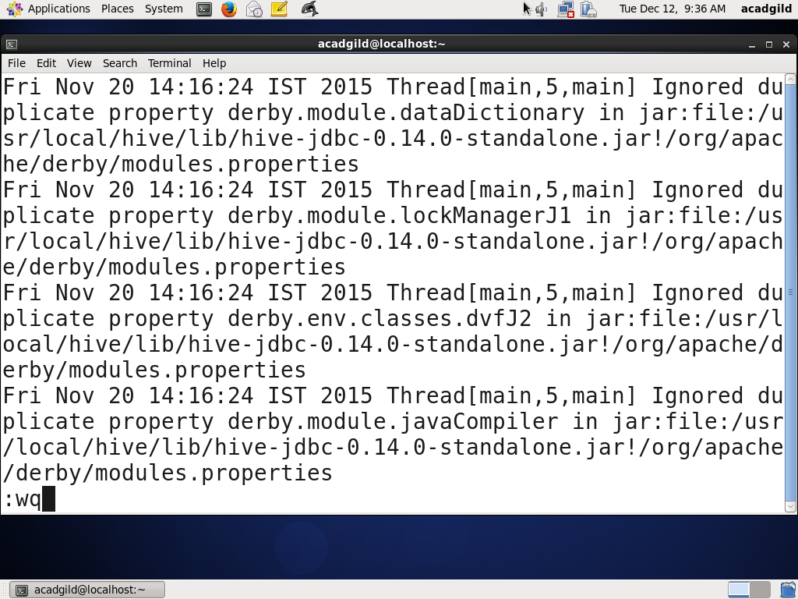

# Linux Command Line Explanation. 
## This is a linux command guide for 15 popular commands. 

***

### pwd: command to show us the path to current directory in the terminal. 

***

### vi: command to open the file and edit the file. 
* You can start vi mode using vi + filename command in terminal. 
 

* In the vi terminal there is several key that is useful. 
    * 1.If you heat  **i**  you enter the nsert mode where you can modify following file. 
    * 2.If you want to save the file edited you need to press **:** + **wq**.
    * 3.If you find matched word in vi mode you need to press **?** + **word you find** .

<table>
    <tr>
        <td></td>
        <td></td>
        <td></td>
    </tr>
</table>

***

### ls: command to show the files and directories in current directory. 

***

### touch: command to  create simple file. 
* You can see test.txt file has been created.  

***

### mkdir: command to create directory.
* new directory called test_dir has been created. 

***

### rm: command to erase file. If you want to erase directory and file inside it you can append -r option.
* 1 test.txt file has been erased
* 2 test_dir directory has been erased. 
<table>
    <tr>
        <td></td>
        <td></td>
    </tr>
</table>

***

### echo: command to print the follwing input. 

***

### cat: command to print the content of follwing file. 
* The content of pig logfile has been printed.  

***

### who: command to print the users who are currently log in.  

***

### cd: command to move to the following directory.   

***

### date: command to print current date or set the time on the machine.   

***

### cal: display simple calendar in the terminal.   

***

### mv: move follwing file to the designated location.    

***

### cp: copy the following file. If you don't put directory file is copied in current directory
* 1 test.txt is copied as a test2.txt in current directory
* 2 test.txt is copied at /home/acadgild/test/test_dir as a test2.txt
<table>
    <tr>
        <td></td>
        <td></td>
    </tr>
</table>

***

### which: show full path to execute following command. 
* 1 Show the full path of **hadoop**, **python**, **cat** command. 

